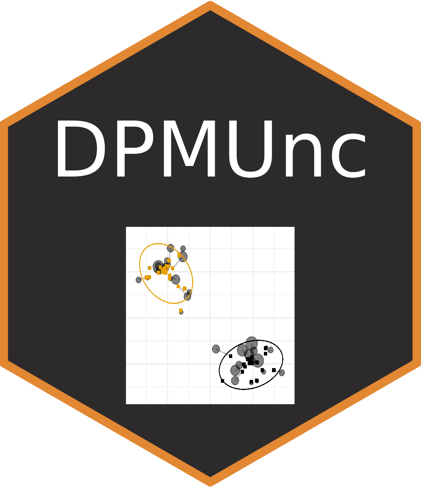

# pkgdown 
# DPMUnc

Dirichlet Process Mixture Modeller taking Uncertainty of points into account during clustering.

See preprint:
> Bayesian clustering with uncertain data
> Kath Nicholls,  Paul D W Kirk,  Chris Wallace
> doi: https://doi.org/10.1101/2022.12.07.519476

This package implements the model described in the preprint, and was originally written by Kath Nicholls [nichollskc](https://github.com/nichollskc). After Kath completed her PhD, maintainence and further development was handed with permission to Chris Wallace [chr1swallace](https://github.com/chr1swallace).
